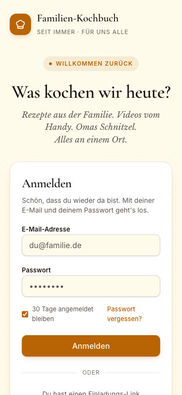
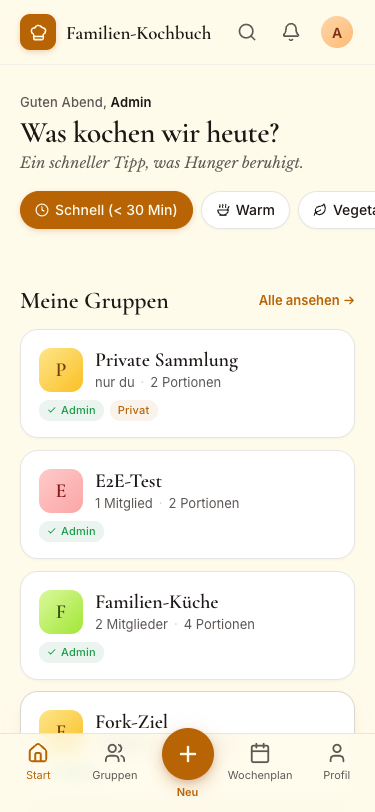
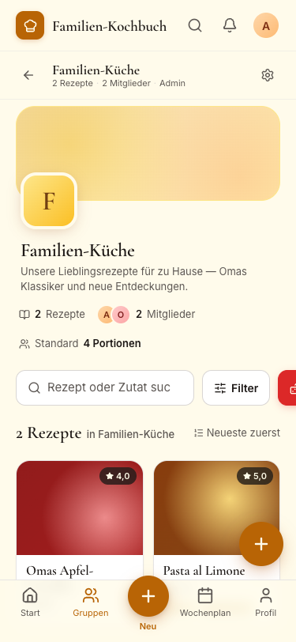
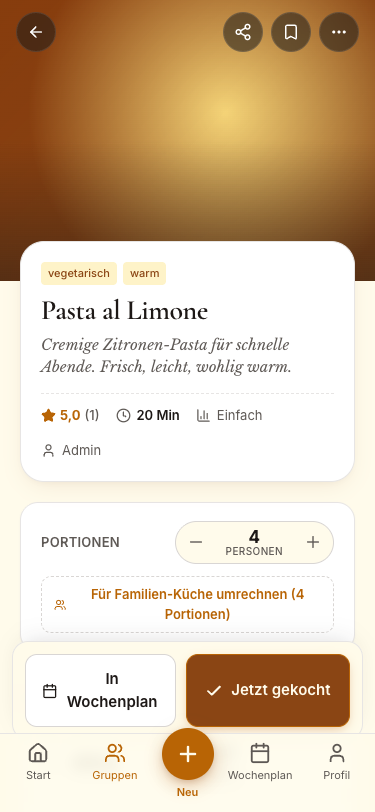
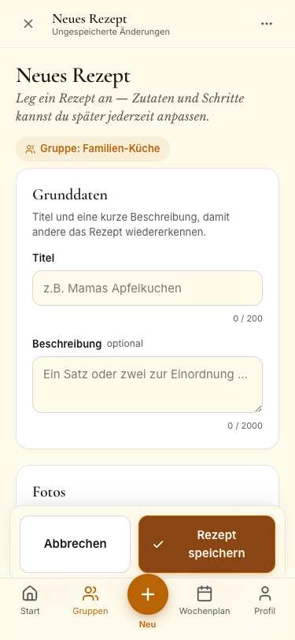

# Familien-Kochbuch

Ein privates, familien-internes digitales Kochbuch. Rezepte werden per
Einladungslink geteilt, in Gruppen gesammelt, bewertet, durchsucht und
zwischen Gruppen kopiert. Die UI ist auf Deutsch; Code, Commits und diese
Datei sind Englisch.

Phase 1 scope, architecture and the underlying product thinking live in
[`docs/plans/2026-04-17-familien-kochbuch-design.md`](docs/plans/2026-04-17-familien-kochbuch-design.md)
and the slice-by-slice implementation plan in
[`docs/plans/phase-1-implementation-plan.md`](docs/plans/phase-1-implementation-plan.md).

---

## Quick start

### Prerequisites

- **Docker** 25+ (Desktop on macOS/Windows, Engine + Compose on Linux)
- **.NET 10 SDK** (for running tests and `dotnet watch` outside Docker)
- **Node.js** 22+ (Node 25 works too)
- **pnpm** 10+ (`corepack enable && corepack prepare pnpm@10 --activate`)
- `curl` + `jq` (only needed for the smoke-test script)

### Boot the full stack

```bash
pnpm install
docker compose up --build -d
open http://localhost/
```

Caddy routes `/api/*` to the .NET API and everything else to the
React PWA. First boot seeds an admin account whose credentials you can
override in a `.env` file at the repo root via `ADMIN_EMAIL` /
`ADMIN_PASSWORD`. The defaults are:

```
email:    admin@familien-kochbuch.local
password: ChangeMe!Admin2026
```

Log in as the admin, click **Jemanden einladen** (on `/profil` or on the
Home invite card), copy the invite URL for every family member, and
paste it into their browser (or mail, or WhatsApp, or carrier pigeon).

Tear down with `docker compose down` (add `-v` to also drop the
Postgres / SeaweedFS / Caddy volumes).

---

## UI Stand (Phase 1.5 — Warme-Küche)

Alle Seiten sind mobile-first (375 × 812 px Screenshots, aufgenommen
auf einem iPhone-X-Viewport). Palette: amber-700 auf cream, Cormorant
Garamond für Überschriften, Libre Baskerville italic für Zitate und
Taglines, Inter für den Rest.

### Login — `/login`

Einladung zum Anmelden mit ruhiger Begrüßung und gepunktetem Pergament-
Hintergrund.



### Startseite — `/`

Persönliche Begrüßung mit Tageszeit, Schnellfilter-Chips, den eigenen
Gruppen und "zuletzt gekocht". Die Glocke oben rechts zeigt einen Punkt,
sobald es offene Einladungen gibt.



### Gruppendetail — `/groups/:id`

Warmer Amber-Banner, überlappendes Avatar-Tile, Stats-Zeile, Filter +
Zufall, gefolgt vom Rezept-Grid. Die rote "Zufall"-Taste springt zu
einem zufälligen passenden Rezept.



### Rezept-Detail — `/groups/:id/recipes/:id`

Hero-Foto (Fallback: deterministischer warmer Verlauf), Titelkarte mit
Tags + Rating, Portionen-Stepper, Zutaten-Checkliste, nummerierte
Schritte und sticky Action-Bar am unteren Rand ("In Wochenplan" +
"Jetzt gekocht").



### Rezeptformular — `/groups/:id/recipes/new`

Sticky Top-Bar mit X-Abbrechen + Serif-Titel, Intro-Block mit Ziel-
Gruppen-Pille, Grunddaten-, Foto-, Zutaten-, Schritt- und Tag-Blöcke,
und unten die sticky "Rezept speichern"-Bar.



---

## Dev loop (hot-reload, no Docker)

The containers are handy for full-system tests, but during feature work
it's faster to run each side natively:

```bash
# Terminal 1 — API with hot-reload against a local Postgres/Redis/SeaweedFS.
docker compose up -d postgres redis seaweedfs
dotnet watch --project apps/api/src/FamilienKochbuch.Api run

# Terminal 2 — Vite dev server with HMR. Proxies /api to localhost:5000.
pnpm dev
```

The Vite dev server listens on <http://localhost:5173>. Caddy is
skipped in this mode; use the Vite server directly.

---

## Test commands

```bash
# .NET — Domain + Infrastructure + Api (WebApplicationFactory integration)
dotnet test apps/api/FamilienKochbuch.sln

# Web — Vitest + RTL + MSW
pnpm -C apps/web test --run

# Shared DTOs + utility tests
pnpm -C packages/shared test --run

# Lint (ESLint flat config)
pnpm lint
```

Phase 1.5 baseline, recorded after DS7:

| Target | Count |
| --- | --- |
| `dotnet test` | 432 |
| `pnpm -C apps/web test --run` | 442 |
| `pnpm -C packages/shared test --run` | 32 |
| **Total** | **906** |

---

## Smoke test

```bash
./scripts/smoke-test.sh             # or: pnpm smoke-test
```

Runs 13 steps against the stack currently reachable at
`http://localhost`: health-check, admin login, invite → signup, group +
recipe CRUD, rating, search, fork, revision-history check, teardown.
Exits 0 on success. Override the target URL with `SMOKE_BASE_URL=…` or
seeded credentials with `ADMIN_EMAIL=…` / `ADMIN_PASSWORD=…`.

---

## Project structure

```
/
├── apps/
│   ├── api/                     # .NET 10 Minimal API (FamilienKochbuch.sln)
│   │   ├── Directory.Build.props
│   │   ├── Dockerfile
│   │   ├── openapi.json         # snapshot of /api/swagger/v1/swagger.json
│   │   ├── src/
│   │   │   ├── FamilienKochbuch.Api/
│   │   │   │   ├── Endpoints/           # Auth, Groups, Recipes, Search, …
│   │   │   │   └── Services/            # FamilienResults, GlobalExceptionHandler, …
│   │   │   ├── FamilienKochbuch.Domain/
│   │   │   └── FamilienKochbuch.Infrastructure/
│   │   │       └── Persistence/Migrations/  # 5 migrations — reviewed per hard-rule
│   │   └── tests/
│   │       ├── FamilienKochbuch.Api.Tests/
│   │       ├── FamilienKochbuch.Domain.Tests/
│   │       └── FamilienKochbuch.Infrastructure.Tests/
│   └── web/                     # Vite 8 + React 19 + Tailwind 4 + VitePWA
│       ├── Dockerfile           # multi-stage build → caddy:2-alpine static serve
│       ├── public/              # favicon, icons, default manifest stub
│       ├── src/
│       │   ├── App.tsx          # router wrapped in <ErrorBoundary>
│       │   ├── components/      # shadcn-style primitives (Button, Skeleton, …)
│       │   ├── features/        # feature modules (auth, groups, recipes, …)
│       │   ├── pwa/             # service-worker registration + update toast
│       │   ├── lib/             # cn() util, api client
│       │   └── test/            # Vitest setup, MSW server + handlers
│       └── vite.config.ts       # VitePWA plugin + runtime cache strategies
├── packages/
│   ├── shared/                  # @familien-kochbuch/shared — DTO types
│   └── config/                  # @familien-kochbuch/config — tsconfig + eslint base
├── infra/
│   ├── Caddyfile                # dev reverse proxy (/api → api, / → web)
│   └── Caddyfile.prod           # prod reverse proxy (Let's Encrypt via $CADDY_DOMAIN)
├── scripts/
│   ├── smoke-test.sh            # end-to-end happy-path check
│   └── export-openapi.sh        # refresh apps/api/openapi.json
├── docker-compose.yml           # dev stack (builds from source)
├── docker-compose.prod.yml      # prod stack (images from GHCR)
├── docs/
│   ├── plans/                   # PRD + implementation plan
│   └── phase-1-progress.md      # slice-by-slice progress tracker
└── .github/
    └── workflows/
        ├── ci.yml               # PR gate (lint + tests)
        └── deploy.yml           # build + push to GHCR; deploy step scaffolded
```

---

## Deployment

`docker-compose.prod.yml` expects the API + web images to be prebuilt and
pushed to GHCR under `ghcr.io/kay-solutions/familien-kochbuch-{api,web}:latest`.
The deploy workflow in `.github/workflows/deploy.yml` handles both the
push and the image build on every commit to `main`. The SSH-to-Hetzner
step is **scaffolded but commented out** — activate it once the VPS is
provisioned and the repo has `VPS_HOST`, `VPS_SSH_KEY`, and `PROD_ENV`
secrets set.

See PRD §11 for the complete deployment story (target platform, TLS,
secrets handling, backups, cost estimate).

### Running prod compose locally

```bash
# one-shot sanity check, using the local CA for TLS
CADDY_DOMAIN=localhost \
POSTGRES_PASSWORD=change-me \
JWT_SIGNING_KEY=$(openssl rand -hex 32) \
ADMIN_EMAIL=admin@example.com \
ADMIN_PASSWORD=ChangeMeNow \
docker compose -f docker-compose.prod.yml up -d
```

Then visit <https://localhost> and accept the self-signed certificate.

---

## Swagger / OpenAPI

Swagger UI is mounted at **`/api/swagger`** in Development only. The
production stack leaves the routes unregistered so the schema can't be
scraped anonymously.

To refresh `apps/api/openapi.json` from the running stack:

```bash
docker compose up -d
pnpm api:openapi          # or: bash scripts/export-openapi.sh
```

The snapshot lives at `apps/api/openapi.json` so downstream clients can
generate their own typed SDKs without needing to boot the service.

---

## Troubleshooting

- **Ports 80/443/5173/5432/6379 already in use.** Change the published
  port on the affected service in `docker-compose.yml` or stop the
  conflicting process — `lsof -i :80` identifies the culprit on macOS.
- **Admin login returns 401 on first boot.** The seeded password only
  applies when no users exist. If you've tried logging in with the wrong
  password and the admin was already seeded, reset with
  `docker compose down -v && docker compose up -d`. (Nukes the volumes —
  only safe in dev.)
- **Photos return 403 Forbidden.** Signed URLs expire after
  `Images:SignatureValidityHours` (default 2 h). Fetch a fresh recipe
  detail to regenerate the URL.
- **Migrations don't apply.** Check `docker compose logs api` — startup
  aborts if the DB schema mismatch is unresolvable. On first boot after
  a schema change, prune with `docker compose down -v`.
- **SeaweedFS data loss on `docker compose down -v`.** Explicit: the
  `-v` flag drops the `seaweedfs-data` volume. Skip `-v` to preserve
  uploaded photos between restarts.
- **`pnpm lint` fails after editing a .cs file.** Lint only runs against
  the web package; unrelated failure usually means a stale cache. Re-run
  `pnpm install` to refresh workspace symlinks.

---

## Contributor notes

- **TDD is non-optional.** Failing tests land in their own commit, then
  the implementation commit turns them green. Reviewers inspect commit
  order.
- **Small commits, push after every logical step.**
- **German UI, English code / commits / docs.**
- When EF migrations arrive, always read the generated `.cs` file before
  committing — EF sometimes bundles unintended schema changes from other
  branches.
- Every 4xx / 5xx JSON response MUST use the unified `FamilienResults`
  helper (see `apps/api/src/FamilienKochbuch.Api/Services/FamilienResults.cs`).
  Tests enforce the `{ code, message, details? }` envelope shape.

---

## Related docs

- [Product design document (PRD)](docs/plans/2026-04-17-familien-kochbuch-design.md)
- [Phase 1 implementation plan](docs/plans/phase-1-implementation-plan.md)
- [Phase 1 progress tracker](docs/phase-1-progress.md)
- [Anti-shortcut reviewer checklist](docs/reviewing/anti-shortcut-checklist.md)
